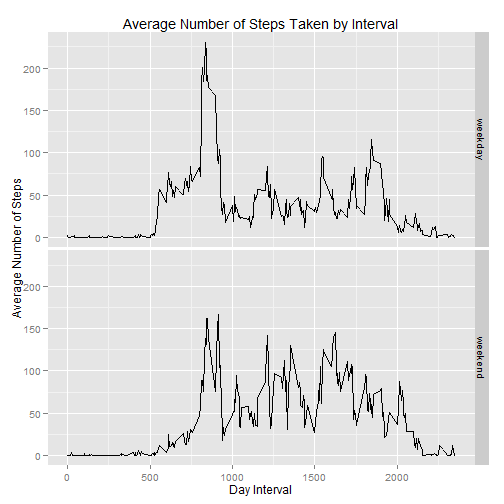

Reproducible Research - Peer Assessment 1
========================================================

Loading and preprocessing the data  
--------------------------------------------------------

1 - Load the data:    


```r
# Set working directory
setwd("D:/Users/jcombadao/Google Drive/onlineclass/coursera/Data Science Specialization/Reproducible Research/peer1")

# Url of the data zip file fileUrl <-
# 'https://d396qusza40orc.cloudfront.net/repdata%2Fdata%2Factivity.zip'

# Download zip download.file(fileUrl, destfile='activity.zip')

# Unzip the data file. Use read.csv() to load the data set into R
activity <- read.csv(unz("activity.zip", "activity.csv"))

```


2 - Process/transform the data (if necessary) into a format suitable for your analysis    


```r
# see structure of data
str(activity)
```

```
## 'data.frame':	17568 obs. of  3 variables:
##  $ steps   : int  NA NA NA NA NA NA NA NA NA NA ...
##  $ date    : Factor w/ 61 levels "2012-10-01","2012-10-02",..: 1 1 1 1 1 1 1 1 1 1 ...
##  $ interval: int  0 5 10 15 20 25 30 35 40 45 ...
```

```r
head(activity)
```

```
##   steps       date interval
## 1    NA 2012-10-01        0
## 2    NA 2012-10-01        5
## 3    NA 2012-10-01       10
## 4    NA 2012-10-01       15
## 5    NA 2012-10-01       20
## 6    NA 2012-10-01       25
```

```r
tail(activity)
```

```
##       steps       date interval
## 17563    NA 2012-11-30     2330
## 17564    NA 2012-11-30     2335
## 17565    NA 2012-11-30     2340
## 17566    NA 2012-11-30     2345
## 17567    NA 2012-11-30     2350
## 17568    NA 2012-11-30     2355
```

```r

# Convert date to date class
activity$date <- as.Date(activity$date, "%Y-%m-%d")
```


What is mean total number of steps taken per day?  
--------------------------------------------------------

Note: for this part of the assignment, you can ignore the missing values in the dataset.  

1 - Make a histogram of the total number of steps taken each day:  


```r
# use ggplot2 to graphs and dplyr to manipulate dataframes
library(ggplot2)
library(scales)
library(dplyr)
```

```
## 
## Attaching package: 'dplyr'
## 
## The following objects are masked from 'package:stats':
## 
##     filter, lag
## 
## The following objects are masked from 'package:base':
## 
##     intersect, setdiff, setequal, union
```

```r

# group data by date and calculate sum of steps in each day
activityDay <- activity %.% group_by(date) %.% summarise(steps = sum(steps))

hist1 <- ggplot(activityDay, mapping = aes(x = steps)) + geom_histogram(fill = "white", 
    colour = "black", binwidth = 1000) + scale_x_continuous("Steps per Day", 
    labels = comma) + scale_y_continuous("Frequency") + ggtitle("Total number of steps taken each day")
hist1
```

 


2 - Calculate and report the mean and median total number of steps taken per day:  


```r
avgTotalStepsDay <- mean(activityDay$steps, na.rm = T)
medianTotalStepsDay <- median(activityDay$steps, na.rm = T)
```


The calculated mean is 10766 and the median is 10765. although these two values are 
almost the same, the distribution is far from being symmetrical. There is a higher density 
between 10,000 and 15,000.  


What is the average daily activity pattern?  
--------------------------------------------------------


1 - Make a time series plot (i.e. type = "l") of the 5-minute interval (x-axis) and the average number of steps taken, averaged across all days (y-axis)


```r
## select data by group and calculate mean for each interval

meanStepsInterval <- activity %.% group_by(interval) %.% summarise(meanSteps = mean(steps, 
    na.rm = TRUE))

plot1 <- ggplot(data = meanStepsInterval, mapping = aes(x = interval, y = meanSteps)) + 
    geom_line() + scale_x_continuous("Time of intervals (discrete 5-minute scale)") + 
    scale_y_continuous("Average number of steps") + ggtitle("Average Number of Steps Taken by Interval")
plot1
```

 


2 - Which 5-minute interval, on average across all the days in the dataset, contains the maximum number of steps?


```r
maxNumbSteps <- filter(meanStepsInterval, meanSteps == max(meanStepsInterval$meanSteps))
maxNumbSteps
```

```
## Source: local data frame [1 x 2]
## 
##   interval meanSteps
## 1      835     206.2
```


It is in the interval 835.


Imputing missing values
--------------------------------------------------------

Note that there are a number of days/intervals where there are missing values (coded as NA). The presence of missing days may introduce bias into some calculations or summaries of the data.

1 - Calculate and report the total number of missing values in the dataset (i.e. the total number of rows with NAs)


```r
sum(is.na(activity))
```

```
## [1] 2304
```


The dataset contains 2,304 missing values.

2 & 3 - Devise a strategy for filling in all of the missing values in the dataset. The strategy does not need to be sophisticated. For example, you could use the mean/median for that day, or the mean for that 5-minute interval, etc.  
Create a new dataset that is equal to the original dataset but with the missing data filled in.


```r
# create a new column with the average steps (already calculated) for each
# interval
activity <- activity %.% left_join(meanStepsInterval, by = "interval")

# create a new column (stepsimp) with the steps imputaded to the average
# steps when NA
activity <- mutate(activity, stepsimp = ifelse(is.na(steps), meanSteps, steps))
```


4 - Make a histogram of the total number of steps taken each day and calculate and report the mean and median total number of steps taken per day. Do these values differ from the estimates from the first part of the assignment? What is the impact of imputing missing data on the estimates of the total daily number of steps?


```r
# group data by date and calculate sum of steps in each day
activityDayimp <- activity %.% group_by(date) %.% summarise(steps = sum(stepsimp))

hist2 <- ggplot(activityDayimp, mapping = aes(x = steps)) + geom_histogram(fill = "white", 
    colour = "black", binwidth = 1000) + scale_x_continuous("Steps per Day", 
    labels = comma) + scale_y_continuous("Frequency") + ggtitle("Total number of steps taken each day")
hist2
```

 

```r

avgTotalStepsDayimp <- mean(activityDayimp$steps)
medianTotalStepsDayimp <- median(activityDayimp$steps)
```


As expected the average is the same. The median changes, which is also expected because the distribution was not symmetrical. The median is not a integer anymore due to the use of average values in the imputation.  
The histogram show an increase in the frequency of average values, particularly evident around 10,000 steps.  


Are there differences in activity patterns between weekdays and weekends?
--------------------------------------------------------

For this part the weekdays() function may be of some help here. Use the dataset with the filled-in missing values for this part.

1 - Create a new factor variable in the dataset with two levels - "weekday" and "weekend" indicating 
ether a given date is a weekday or weekend day.


```r
# The system is in Portuguese, for English we can use the sentence commented
# out activity$dayType <- ifelse(weekdays(activity$date) %in% c('Satuday',
# 'Sunday'),'weekend', 'weekday')
activity$dayType <- ifelse(weekdays(activity$date) %in% c("sábado", "domingo"), 
    "weekend", "weekday")

head(activity)
```

```
##   steps       date interval meanSteps stepsimp dayType
## 1    NA 2012-10-01        0   1.71698  1.71698 weekday
## 2    NA 2012-10-01        5   0.33962  0.33962 weekday
## 3    NA 2012-10-01       10   0.13208  0.13208 weekday
## 4    NA 2012-10-01       15   0.15094  0.15094 weekday
## 5    NA 2012-10-01       20   0.07547  0.07547 weekday
## 6    NA 2012-10-01       25   2.09434  2.09434 weekday
```


2 - Make a panel plot containing a time series plot (i.e. type = "l") of the 5-minute interval (x-axis) and the average number of steps taken, averaged across all weekday days or weekend days (y-axis).  


```r
# select data by group and calculate mean for each interval

meanStepsInterval2 <- activity %.% group_by(interval, dayType) %.% summarise(meanSteps = mean(stepsimp))


plot2 <- ggplot(data = meanStepsInterval2, mapping = aes(x = interval, y = meanSteps)) + 
    geom_line() + facet_grid(dayType ~ .) + scale_x_continuous("Day Interval") + 
    scale_y_continuous("Average Number of Steps") + ggtitle("Average Number of Steps Taken by Interval")
plot2
```

 


In the weekdays there are more pronounced peaks and more activity earlier in the day and the activity tends to be much lower earlier in the afternoon. In the weekend, the activity is much more distributed along the day, tending to start later in the day and to last more.


